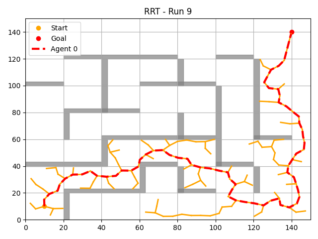
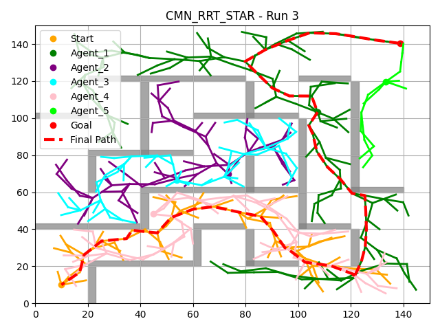

# NeuroMini

### Dependencies

To run this code, install the following Python packages:

```bash
pip install numpy matplotlib tqdm scipy
```

### Path-Planning Algorithms

This repository provides three path-planning algorithms:

- **RRT (Rapidly-exploring Random Trees)**: Rapidly generates a feasible path by incrementally building a tree from random points towards the goal.
    
- **RRT* (Optimised Rapidly-exploring Random Trees)**: Improves upon basic RRT by integrating cost-aware rewiring, ensuring more optimal paths.
    
- **CMN-RRT* (Central Multi-Node Rapidly-exploring Random Trees)**: Extends RRT* by using multiple root nodes (agents) simultaneously expanding toward the goal. When any tree reaches the goal, intersecting trees connect, significantly reducing redundant exploration and improving path optimality and robustness.
    

Use one of the following algorithm identifiers in your command:

1. `rrt`
    
2. `rrt_star`
    
3. `cmn_rrt_star`
    

### Available Maps

The algorithms can be benchmarked on five predefined map types designed to evaluate performance in diverse environments:

1. `empty` (baseline environment without obstacles)
    
2. `diagonal` (map with diagonal barrier and narrow passages)
    
3. `labyrinth` (maze-like corridors)
    
4. `rectangles` (random rectangular obstacles)
    
5. `random_polygons` (irregular polygon-shaped obstacles)
    

### Running Individual Tests

You can perform individual algorithm tests using the `main.py` script located in `src/2D/`:

```bash
python src/2D/main.py --num_agents 1 --map_size 100 100 --step_size 1.0 --map_type labyrinth --algorithm rrt --live_plot
```

Remove the `--live_plot` argument for faster execution without visualisation.

### Benchmarking

To run multiple benchmark tests for statistical evaluation, use `benchmark.py` located in `src/2D/`:

```bash
python src/2D/benchmark.py --num_runs 10 --num_agents 3 --map_size 200 200 --step_size 1.0 --map_type labyrinth --num_obstacles 10
```

- `--num_runs`: Number of repeated tests for averaging results.
    
- `--num_agents`: Number of simultaneous agents (relevant for CMN-RRT*).
    

Results are saved in the `src/2D/results/` directory, including CSV, JSON summaries, and visual plots.

### Running All Tests Automatically

The provided bash script `run_all.sh` located in `src/2D/` automates testing across all algorithms and maps, but note that this comprehensive benchmarking process takes significantly more time:

```bash
bash src/2D/run_all.sh
```

### Benchmarking and Performance

The algorithms are evaluated on:

- **Success Rate**
    
- **Planning Time**
    
- **Path Length**
    

CMN-RRT* demonstrates superior path optimality and robustness, particularly in complex environments.

### Algorithm Examples

#### RRT



#### RRT*


#### CMN-RRT*


